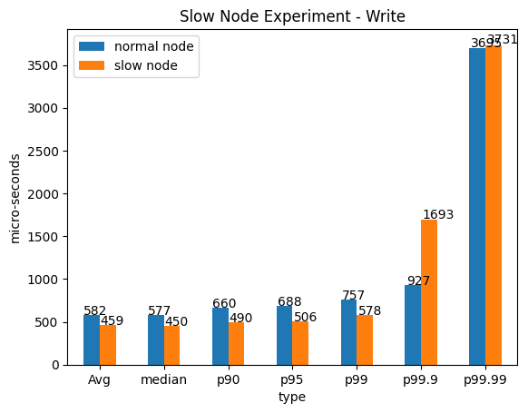
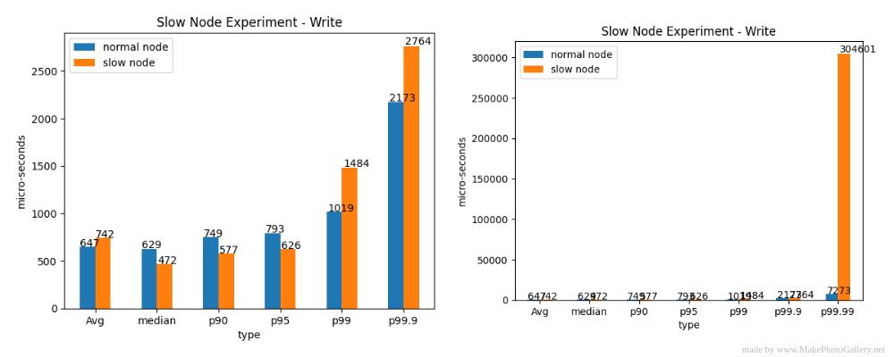
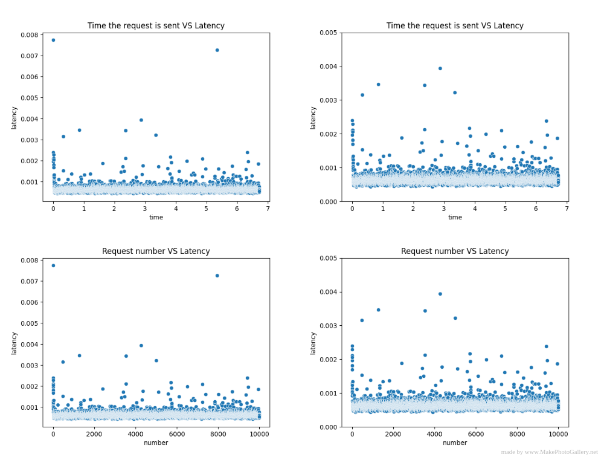
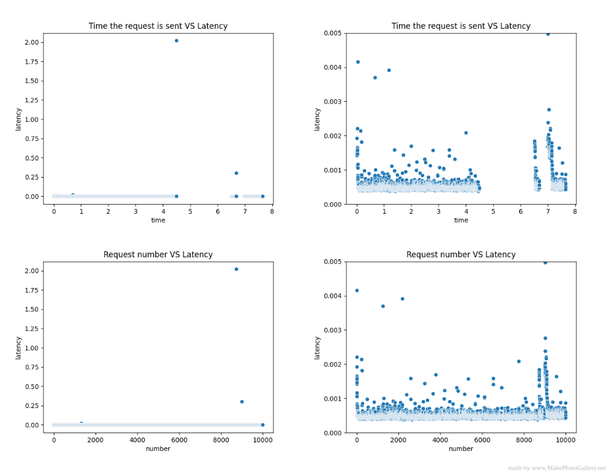

# Ins Report

Ins is a highly available key-value store based on raft protocol. Written in C++. Ins supports Leader Election, Log Replication and Log Compaction. 
But in this report we are going to explore the following areas:

1. Initialization / Election
2. Put Query
3. Get Query

And in the end we are going to explore performance of a three node cluster in the following situations:
1. Slow follower
2. Slow network

## Setup
### Normal cluster
The setup for a normal cluster situation is pretty straight-forward. There are three docker containers running on the same machine where each docker container acts as a node. I went for docker containers because it is easy to control the resources allocated to that container. And all the containers run on host network. And all the dockers have a cpu usage limit of 1.5 

### Slow follower
To simulate a slow follower, one of the container in the normal cluster has a cpu usage limit as 0.02 which is 75 times less than the other containers.

### Slow Network
To simulate a slow network, Instead of the containers being on host network, they are connected using a bridge network.
Packet delay is introduced to the said bridge network using netem.

### Client
Client is run on the local machine. Client sends requests synchronously. It has only one thread and one connection to the server. The client sends the request to the first node, if the said node is the leader the node goes through the request or else it responds to the client with the address of the leader and client sends the same request again to the leader. 
The same process goes on for each request, and the request is first sent to the last successful address.

## Code Flow
### Initialization / Election

- The node is first initialized and all the checks related to cluster are done and database is created.
- There are three main threads running parallelly
  1. CommitIndexObserve() - Applies the unapplied but committed log indices.
  2. ReplicateLog() - Sends sync calls asking follower nodes to append log entries. For each follower a separate thread is run.
  3. BroadcastHeartbeat() - Broadcasts heartbeat to the followers to check if they are alive.
    
- The leader sends an empty append entries request which calls back to HeartbeatCallback where it checks if majority of followers respond. If not its transferred to follower. 
- The CheckLeaderCrash() periodically checks if the leader has crashed if so a new leader is elected. 
### Put Query

- The client sends a sync put request to the server which is already initialised, election is done and a leader is elected.
- The leader node then appends the request to its log.
- The replication log threads which are running in parallel see the the leader log is updated and send sync requests to followers asking them to append requests to their logs as well
- The CommitIndexObserve thread applies the unapplied logs to the database and sends an ack to client.

### Get Query

- The client sends a sync get request to the server which is already initialised, election is done and a leader is elected.
- There is a timeout called heartbeat_read_timeout which is 1000 times the election timeout. 
  1. If it timeouts out, the leader node sends heartbeats to the followers to check if they are alive. If the leader nodes gets responses from majority of the followers, it reads the key-value from the database and returns it to the client.
  2. If it hasn't timed out yet the leader node reads the key-value from the database and directly sends it to the client.
  
## Performance

### Slow Node

#### Experiment

1. Start the containers with cpu usage limit of 1.5 for each and wait for 20s for election to be done.
2. Start the client and send 10000 put requests synchronously and then 10000 get requests.
3. Calculate latency percentiles
4. Kill all the containers
5. Now Start two containers with cpu usage limit of 1.5 for each and a container with 0.02 cpu usage limit to simulate slow node and wait for 20s for election to be done.
6. Run steps 2 to 4

The script for the above can be found [here](./../sandbox/slow_node/slow_node.sh)

#### Results
I found something wrong in the code logic which I am assuming is a bug which caused in inconsistency in results from time to time. We will get into the bug at the end but for now these are the results when the bug is not encountered. 

The following results are based on the fact that the leader
generally fails receive an ack response from slower nodes before the request timesout
which is expected.

##### Read

As we can see the all the latency types are quite close. 

The reason for this is because as discussed in the 
Get Query part of the report, The leader has a heartbeat_read_timeout which 1000 times election timeout, 
which is basically a timeout to run a check if 
majority of the followers are alive, here majority is just one so the issue of not getting response from the slower node is of no concern. In this case the check is only run once at the start and then the leader doesn't send requests to the followers to check what the value is for the key requested, Instead the leader just reads from its database and returns it.

So it's basically a single client - server type setup. As the leader nodes act as servers here and in both cases the leader nodes have the same resources so the latencies are quite similar.

##### Write

As we can see the latency for the slower follower case is lesser than the normal follower case but the difference is very small considering we are dealing with micro seconds here.

The reason for this is that the leader generally fails receive an ack response for the replication request it sends to slow follower before the timeout which is expected, In the code as discussed in the Put Query part of the report there is one thread each running parallelly for sending replication requests to each of the follower and if the follower fails to ack the request back to the leader before it timesout, the thread sending these replication requests to the follower goes into hibernation(Thread sleeps) for a while.

When the thread sending replication requests to the slower node goes into hibernation the load the leader has to push decreases. So now it just has to send replication requests to one follower which reduces the total RPCs to send which in turn results in the reduced latencies.  

All the logs related to this experiment can be found [here](./../sandbox/slow_node)

### Slow Network

#### Experiment

1. Start the containers on the bridge network with cpu usage limit of 1.5 for each and wait for 5s for election to be done.
2. Start the client and send 10000 put requests synchronously and then 10000 get requests.
3. Calculate latency percentiles
4. Kill all the containers
5. Using Netem a packet delay of 200ns with 50ns jitter is applied to the bridge network that the containers use.
6. Run steps 2 to 4
7. Delete the delay applied

The script for the above can be found [here](./../sandbox/slow_network/slow_network.sh)

#### Results

##### Write

##### Read

It is very clear from the graphs that the slow network has higher latencies. These are higher latencies and lower throughput are direct implications of the delay in the RPC requests reaching the destination.

All the logs related to above experiment can be found [here](./../sandbox/slow_network/)

### Slow Node - BUG

Lot of the times the slow node doesn't receive a heartbeat before the timeout
from the leader which makes it believe that the leader is not active
so it increases its election term and broadcasts requests to all the nodes
asking for a Vote and if it gets a response it will a negative response as its logs are not upto date.
And if it doesn't get responses it will increase its election term and keep sending the Vote broadcasts.

Usually this shouldn't be an issue, The other nodes keep sending negative responses 
as the slow nodes log is not up to date and as the majority of the nodes which is
two here are alive and up to date as they are not slow.

Now the issue in the code is that, when the leader sends replication
requests and slow node receives it and responds back with its current term.
There is a check in the code that if the term of the follower which is retrieved 
from the response is higher than the current leaders term, the leader's status is changed to follower
but the current_leader_id is not updated,
which leaves the cluster leader less and after a while election is triggered by one of the node as the heartbeats are not received by any of the nodes.

When the cluster is leader less and the client sends a request at the same time to the leader which is now a 
follower responds back with the leader_id which is itself. Which causes a loop till the leader gets elected.

There are a few other places in the code where the same issue may arise.

The issue discussed above happens when the slow node receives the replicate request and responds back and the 
current term of the slow node is higher than the leader which is highly plausible as it keeps for broadcasting for votes and increasing its term.

The following are the results when this bug is experienced

#### Write 

##### Latency Comparision

Both the images are same, one is without p99.99. 

As you can the p99.99 of the slow node case is almost 30 times higher than
that of the normal node case. There is a bump is only p99.99 because the requests are
sent synchronously in this case so only few requests face issue due to the bug discussed above.

##### Latency Scatter Plot (Normal Node Case)

This is the normal node case where the above discussed bug doesn't occurs as no slow node.

The above images are as follows:
1. Latency vs Time (Actual y scale)
2. Latency vs Time ([0, 0.005] y scale)
3. Latency vs Request Number (Actual y scale)
4. Latency vs Request Number ([0, 0.005] y scale)

##### Latency Scatter Plot (Slow Node Case)

This is the slow node case where the above discussed bug occurs as there is a slow node.
The above images are as follows:
1. Latency vs Time (Actual y scale)
2. Latency vs Time ([0, 0.005] y scale for better visualisation)
3. Latency vs Request Number (Actual y scale)
4. Latency vs Request Number ([0, 0.005] y scale for better visualisation)

Now if we compare Latency vs Time ([0, 0.005] y scale) plot in the above images. We can observe that there are gaps
in the slow node case which are caused due to the bug discussed above.

In the client side code, The client sends a request and if the response is an 
address to the leader, it retries sending the same request to the leader. And if any of 
those request responses are negative the client sleeps for 1s. 

In the image 2 of slow node case we can see a 2 sec gap which is caused by a 2 sec latency request which means that the client 
sends a request gets a negative response sleeps for 1 sec and then retries again
and gets a negative response again and sleeps 1 sec again.

Similarly with the 1 sec gap.

#### Fix

The fix for the bug is that instead of just comparing election terms, the last committed index
and the last applied index of the leader and follower which sends response 
should be checked before changing the status of the leader to follower. Just like
the rules applied while voting.
